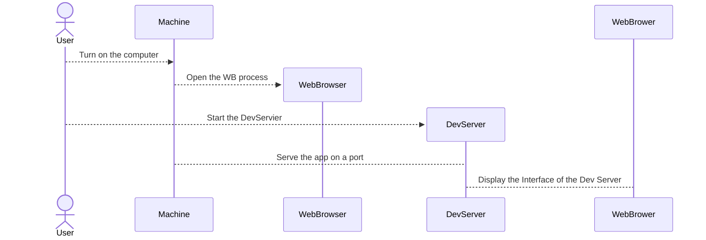

### Sequence

```mermaid
sequenceDiagram
    actor User
    User-->>Machine: Turn on the computer
    create participant WebBrowser
    Machine-->>WebBrowser: Open the WB process
    create participant DevServer
    User-->>DevServer: Start the DevServier
    Machine-->DevServer: Serve the app on a port
    DevServer-->WebBrower: Display the Interface of the Dev Server
```
